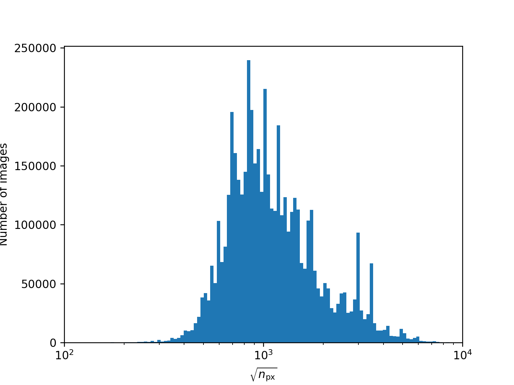
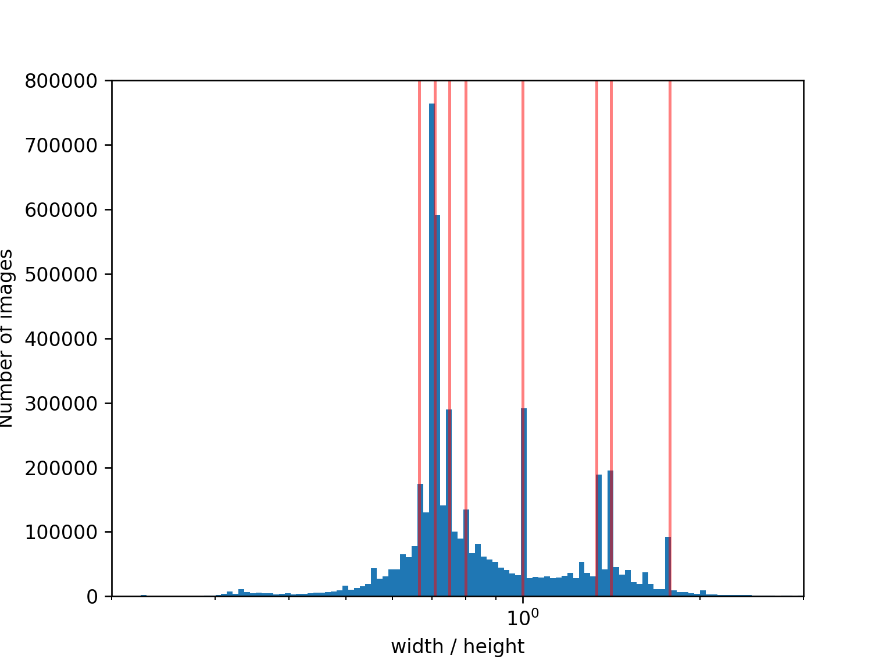

# Aspect Ratio
Image widths and heights are either multiplied to get the number of pixels $n_\mathrm{px}$ or divdided to get the aspect ratio.
In log-log space this is equivalent to a simple change in basis where the axes are rotated by 45°.
The aspect ratios and $\sqrt{n_\mathrm{px}}$ are then filled into histograms
(drawing the square root does not change the visual shape of the plot but is easier to interpret).

## Image Size

$\sqrt{n_\mathrm{px}}$ which is be interpreted of the size of a hypothetical square image with the same number of pixels.
$\sqrt{n_\mathrm{px}}$ roughly follows a log-normal distribution around $\sqrt{n_\mathrm{px}} = 850$ that is skewed towards higher values.
It can be safely assumed that the visible spikes are not due to Poisson noise.
The spikes are likely caused by user preference though aliasing effects (regarding bin edges) were not studied.

## Image Aspect Ratios

There is no obvious choice for a distribution that would fit the aspect ratio distribution.
There are several visible spikes for common aspect ratios.
The following aspect ratios are highlighted in the image (from left to right):
2:3, 1:1.41 (see [ISO 216](https://en.wikipedia.org/wiki/ISO_216)), 3:4, 4:5, 1:1, 4:3, 1.41:1, and 16:9.
