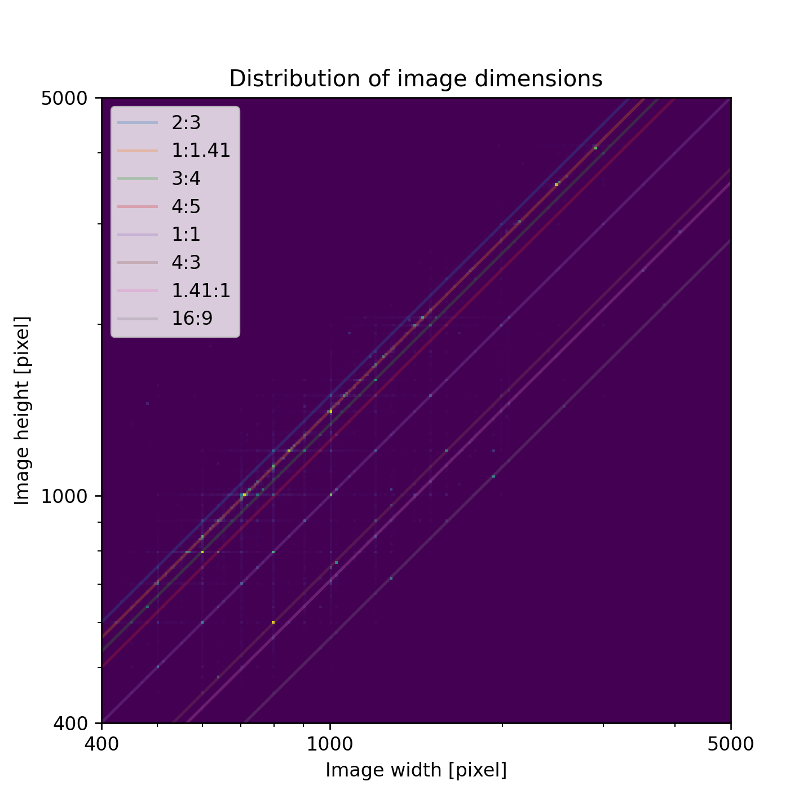
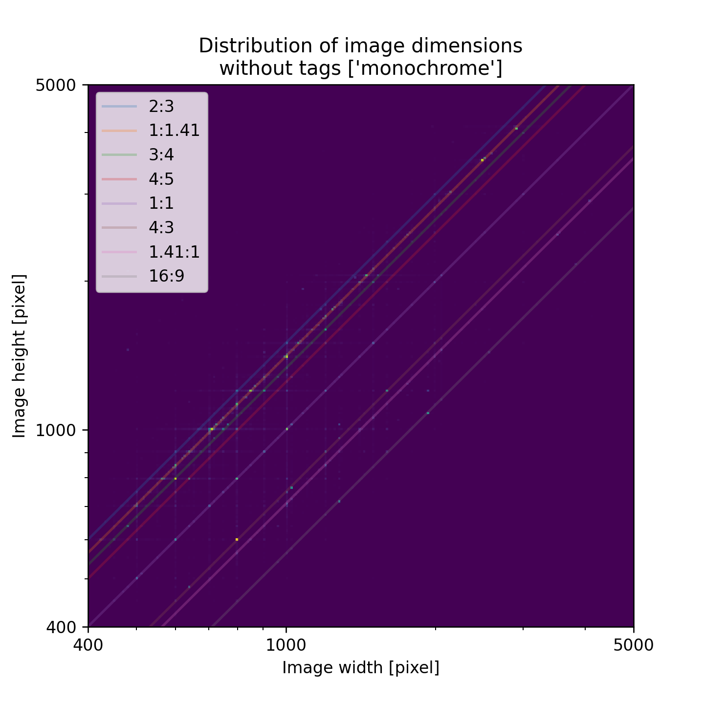

# Dimension 2d
Image widths (x axis) and heights (y axis) are filled into a two-dimensional histogram.
The x and y axes as well as the bin sizes are scaled logarithmically.
Images with different sizes but the same aspect ratio will be located on lines with a slope of 1 in log-log space.
The y intercept of said lines determines the aspect ratio.
The purpose of the visualization is to provide an intuitive understanding where there are clusters of images and whether images conform to specific aspect ratios.

The Python script in this directory can filter images by certain tags.
## All Images

Dark blue indicates few images while yellow indicates many images.
When considering all images, five aspect ratios in particular stand out: 16:9, 4:3, 1:1, 3:4, and 1:1.41 (likely due to [ISO 216](https://en.wikipedia.org/wiki/ISO_216)).
The most common aspect ratio is 1:1.41 with roughly a quarter of images adhering to this aspect ratio (see below).
However, the majority of images do not conform to one of those aspect ratios.
A few clusters can be spotted (e.g. 800x600 or 600x800) and there is a clear preference for images where at least one dimension is a multitude of 100.
## Monochrome Only

When considering only images with the "monochrome" tag the distribution changes significantly.
The preference for the 1:41 aspect ratio becomes even more pronounced with almost half of all monochrome images adhering to this aspect ratio.
However, only about 10% of the images in the dataset have the monochrome tag.
## Color Only

Danbooru does not seem to have a explicit tag for color images.
Instead images seem to be assumed color images by default.
The distribution of color images is therefore determined by excluding the monochrome tag.
About 90% of images do not have the monochrome tag.
The distribution of color image dimensions is not significantly different from the distribution when considering all images.
## Numerical Data
The following table contains numerical data regarding the prevalence of aspect ratios.
An image is considered to be adhering to an aspect ratio when the ratio of the discreet width and height of an image falls within 2% of the aspect ratio.

| Aspect Ratio | All, Absolute | All, Percentage | Monochrome, Absolute | Monochrome, Percentage | Color, Absolute | Color, Percentage |
| ------------ | ------------- | --------------- | -------------------- | ---------------------- | --------------- | ----------------- |
| 16:9         | 99921         | 2.00%           | 2023                 | 0.46%                  | 97898           | 2.14%             |
| 4:3          | 212679        | 4.25%           | 10452                | 2.40%                  | 202227          | 4.43%             |
| 1:1          | 315286        | 6.30%           | 15888                | 3.65%                  | 299398          | 6.56%             |
| 3:4          | 367227        | 7.34%           | 22835                | 5.25%                  | 344392          | 7.54%             |
| 1:1.41       | 1319576       | 26.38%          | 199872               | 45.92%                 | 1119704         | 24.52%            |
| Other        | 2686883       | 53.72%          | 184164               | 42.31%                 | 2502719         | 54.81%            |
| Total        | 5001572       | 100.00%         | 435234               | 100.00%                | 4566338         | 100.00%           |

The aspect ratios of images are overall diffuse.
When desiring at least a million images and a consistent aspect ratio only the 1:1.41 aspect ratio is suitable.
The 1:1 aspect ratio while popular for neural networks is not widely used in the Danbooru dataset.
